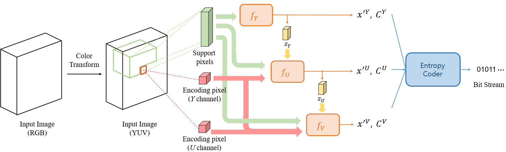
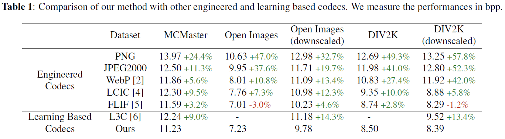
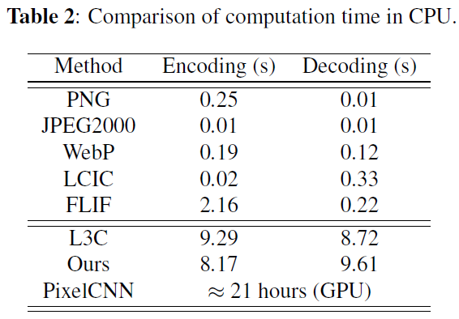

Implementation of "CHANNEL-WISE PROGRESSIVE LEARNING FOR LOSSLESS IMAGE COMPRESSION"

Hochang Rhee, Yeong Il Jang, Seyun Kim, and Nam Ik Cho

## Environments
- Ubuntu 18.04
- [Tensorflow 1.9](http://www.tensorflow.org/)
- CUDA 9.0 & cuDNN 7.6.5
- Python 3.5.5

## Abstract

This paper presents a channel-wise progressive coding system for lossless compression of color images. We follow the classical lossless compression scheme of LOCO-I and CALIC, where pixel values and coding contexts are predicted and forwarded to the entropy coder for compression. The contribution is that we jointly estimate the pixel values and coding contexts from neighboring pixels by training a simple multilayer perceptron in a residual and channel-wise progressive manner. Specifically, we obtain accurate pixel prediction along with coding contexts that reflect the magnitude of local activity very well. These results are sent to an adaptive arithmetic coder that appropriately encodes the prediction error according to the corresponding coding context. Experimental results demonstrate the effectiveness of the proposed method in high-resolution datasets.
<br><br>

## Proposed Method

### <u>Overall framework of proposed method</u>

<p align="center"></p>

We first apply a reversible color transform proposed in to the input RGB images to decorrelate the color components. Then, for each encoding pixel, prediction for the pixel value and coding context are simultaneously generated in the raster scan order. Afterward,
to utilize the AAC as our entropy coder, we quantize the obtained real-valued coding contexts into N steps, where the level of the quantized coding context is proportional to the magnitude of the local activity. In AAC, individual entropy coder is employed for each quantized coding context, because the statistics of prediction error differs depending on the local activity. Finally, the prediction error is compressed into a bitstream based on the corresponding quantized coding context through the AAC.

## Experimental Results

**Results on compression performance**

<p align="center"></p>

Comparison of our method with other engineered and learning based codecs. We measure the performances in bits per pixel (bpp). The difference in percentage to our method is highlighted in green if our method outperforms and in red otherwise.

**Results on CPU time**

<p align="center"></p>

Comparision of computation time (CPU time in seconds). We compared times for 512 x 512 image.

**Test Data**

[MCM]   (https://www4.comp.polyu.edu.hk/~cslzhang/CDM_Dataset.htm)

[DIV2K] (https://data.vision.ee.ethz.ch/cvl/DIV2K/)

[Open Images] (https://storage.googleapis.com/openimages/web/index.html)

## Brief explanation of contents

```
├── python_weights_training : python code for training MLP weights
    ├──> ckpt : trained models will be saved here
    └──> data : train/valid/test data should be saved here
└── c_compression : c++ code for compressing images with MLP weights obtained from python code

```

## Guidelines for Codes

### Training

Configuration should be done in **config.py**.

[Options]
```
python main.py --gpu=[GPU_number] --epoch=[Epochs to train]
```

MLP weights of channel Y,U,V will be saved in **weights_y.txt**, **weights_u.txt**, **weights_v.txt**.

### Test (Compression)

Make sure MLP weights.txt and input images are saved at c_compression/x64/Release.

**Encoding**
```
ICIP_Compression.exe e [source file (ppm)] [compressed file (bin)]
```

**Decoding**
```
ICIP_Compression.exe d [compressed file (bin)] [decoded file (ppm)]
```

#### Generate TFRecord dataset
- Refer to [MainSR](https://www.github.com/JWSoh/MainSR) repo.
- Run generate_TFRecord_MZSR.py

#### Train MZSR
Make sure all configurations in **config.py** are set.

[Options]
```
python main.py --train --gpu [GPU_number] --trial [Trial of your training] --step [Global step]

--train: Flag in order to train.
--gpu: If you have more than one gpu in your computer, the number denotes the index. [Default 0]
--trial: Trial number. Any integer numbers can be used. [Default 0]
--step: Global step. When you resume the training, you need to specify the right global step. [Default 0]
```

### Test

Ready for the input data (low-resolution) and corresponding kernel (kernel.mat file.)

[Options]
```
python main.py --gpu [GPU_number] --inputpath [LR path] --gtpath [HR path] --savepath [SR path]  --kernelpath [kernel.mat path] --model [0/1/2/3] --num [1/10]

--gpu: If you have more than one gpu in your computer, the number designates the index of GPU which is going to be used. [Default 0]
--inputpath: Path of input images [Default: Input/g20/Set5/]
--gtpath: Path of reference images. [Default: GT/Set5/]
--savepath: Path for the output images. [Default: results/Set5]
--kernelpath: Path of the kernel.mat file. [Default: Input/g20/kernel.mat]
--model: [0/1/2/3]
    -> 0: Direct x2
    -> 1: Multi-scale
    -> 2: Bicubic x2
    -> 3: Direct x4
--num: [1/10] The number of adaptation (gradient updates). [Default 1]

```

You may change other minor options in "test.py."
Line 9 to line 17.

The minor options are shown below.
```
self.save_results=True		-> Whether to save results or not.
self.display_iter = 1		-> The interval of information display.
self.noise_level = 0.0		-> You may sometimes add small noise for real-world images.
self.back_projection=False	-> You may also apply back projection algorithm for better results.
self.back_projection_iters=4	-> The number of iteration of back projection.
```

### An example of test codes

```
python main.py --gpu 0 --inputpath Input/g20/Set5/ --gtpath GT/Set5/ --savepath results/Set5 --kernelpath Input/g20/kernel.mat --model 0 --num 1
```

## Citation
```
@article{soh2020meta,
  title={Meta-Transfer Learning for Zero-Shot Super-Resolution},
  author={Soh, Jae Woong and Cho, Sunwoo and Cho, Nam Ik},
  journal={arXiv preprint arXiv:2002.12213},
  year={2020}
}

@inproceedings{soh2020meta,
  title={Meta-Transfer Learning for Zero-Shot Super-Resolution},
  author={Soh, Jae Woong and Cho, Sunwoo and Cho, Nam Ik},
  booktitle={Proceedings of the IEEE Conference on Computer Vision and Pattern Recognition},
  year={2020}
}
```

## Acknowledgement
Our work and implementations are inspired by and based on
ZSSR [[site](https://github.com/assafshocher/ZSSR)] and MAML [[site](https://github.com/cbfinn/maml)].
